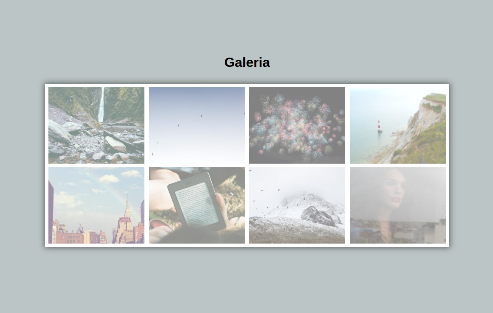

# 🖼️ Estágio-SULTS-Curso-SerFrontend-Projeto7-Galeria

Sétimo projeto desenvolvido durante o curso **SerFrontend**, realizado durante meu estágio na **SULTS** 🚀
Este projeto tem como objetivo criar uma **galeria de imagens responsiva**, aplicando boas práticas de **HTML5 e CSS3**.

---

## 💡 Sobre o projeto

O desafio consistia em construir uma página que exibisse uma **galeria elegante e responsiva**, com **efeitos visuais sutis** e **organização em grid**.
O foco foi o **aperfeiçoamento das técnicas de layout**, **posicionamento de elementos** e **responsividade**.

---

## 🛠️ Tecnologias utilizadas

* 🧱 **HTML5** — Estrutura semântica da página
* 🎨 **CSS3** — Estilização, layout e responsividade
* ⚙️ **Flexbox / Grid Layout** — Organização da galeria
* 🌗 **Sombras e transições** — Para um visual moderno e agradável

---

## 📸 Demonstração

---

## 👨‍💻 Autor

Desenvolvido por **Yuri Duarte** durante o estágio na **SULTS**,
como parte do curso **SerFrontend** 💼